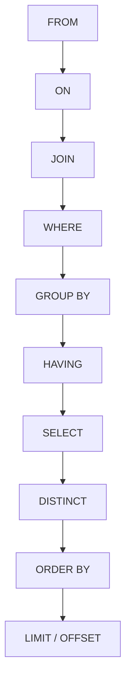

# SQL Order of Execution

When you write an SQL query, you usually think of it in the order you type the keywords (SELECT → FROM → WHERE → GROUP BY → HAVING → ORDER BY → LIMIT). However, the **SQL engine** does **not** execute the query in that order.

Instead, the database follows a logical **order of execution**, which is important to understand when writing queries, debugging, or optimizing performance.

---

## Logical Order of Execution

1. **FROM** → Choose and join tables.
2. **ON** → Apply join conditions.
3. **JOIN** → Combine tables.
4. **WHERE** → Filter rows (before grouping).
5. **GROUP BY** → Group rows into buckets.
6. **HAVING** → Filter groups.
7. **SELECT** → Choose columns/expressions.
8. **DISTINCT** → Remove duplicates.
9. **ORDER BY** → Sort results.
10. **LIMIT / OFFSET** → Pick the final subset of rows.

---

## Diagram: SQL Order of Execution



---

## Example

```sql
SELECT department, COUNT(*) AS lecturers_count
FROM employees
WHERE salary > 50000
GROUP BY department
HAVING COUNT(*) > 5
ORDER BY lecturers_count DESC
LIMIT 3;
```

### How it executes logically:
1. **FROM employees** → Take all rows from employees.
2. **WHERE salary > 50000** → Keep only employees with salary above 50k.
3. **GROUP BY department** → Group remaining rows by department.
4. **HAVING COUNT(*) > 5** → Keep only groups with more than 5 employees.
5. **SELECT department, COUNT(*)** → Choose department and count.
6. **ORDER BY lecturers_count DESC** → Sort by count (largest first).
7. **LIMIT 3** → Return top 3 departments.

---

## Key Takeaways
- **WHERE filters rows before grouping.**
- **HAVING filters groups after aggregation.**
- **ORDER BY happens near the end.**
- **LIMIT is the very last step.**
